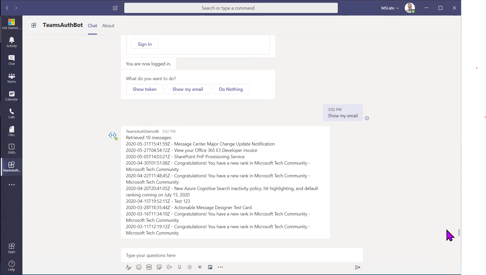

# Teams bot using Microsoft Graph

This bot has been created using [Bot Framework](https://dev.botframework.com), it shows how to get started with building a bot for Teams which calls the Microsoft Graph.

## Summary

This is a bare-bones demo that displays recent email for the logged in user. It's intended to demonstrate how to call the Microsoft Graph from a Bot with user delegated permission.



This sample is derived from the OAuth sample in the [BotBuilder-Samples](https://github.com/microsoft/BotBuilder-Samples/tree/main/samples/javascript_nodejs/46.teams-auth) repo. It elaborates on that demo by providing an option to call the Graph API after obtaining an access token from Azure AD.

Note that Microsoft Teams bots receive an Invoke activity rather than the Event activity used in other bot channels. _This Invoke Activity must be forwarded to the dialog if the OAuthPrompt is being used._ This is done by subclassing the TeamsActivityHandler and implementing handleTeamsSigninVerifyState.

The sample uses the bot authentication capabilities in [Azure Bot Service](https://docs.botframework.com), providing features to make it easier to develop a bot that authenticates users to various identity providers such as Azure AD (Azure Active Directory), GitHub, Uber, etc.

Note: The Teams manifest.json should include validDomains: [ "token.botframework.com" ]  See [install-and-test-the-bot-in-teams](https://docs.microsoft.com/en-us/microsoftteams/platform/bots/how-to/authentication/add-authentication#install-and-test-the-bot-in-teams)

## Frameworks


## Prerequisites

* [Office 365 tenant](https://dev.office.com/sharepoint/docs/spfx/set-up-your-development-environment)
* An Azure Subscription [associated with the same tenant](https://laurakokkarinen.com/how-to-use-the-complimentary-azure-credits-in-a-microsoft-365-developer-tenant-step-by-step/)
* [Node.js](https://nodejs.org) version 10.14.1 or higher

    ```bash
    # determine node version
    node --version
    ```

## Version history

Version|Date|Author|Comments
-------|----|----|--------
1.0|May 30, 2020|Bob German|Initial release
0.0 |February 28, 2020|Azure Bot Team|Original sample from Microsoft/BotBuilder-Samples

## Disclaimer

**THIS CODE IS PROVIDED *AS IS* WITHOUT WARRANTY OF ANY KIND, EITHER EXPRESS OR IMPLIED, INCLUDING ANY IMPLIED WARRANTIES OF FITNESS FOR A PARTICULAR PURPOSE, MERCHANTABILITY, OR NON-INFRINGEMENT.**

---

## Minimal Path to Awesome

You can safely skip these instructions and follow the Bot Framework documentation [Add Authentication to a bot](https://docs.microsoft.com/en-us/azure/bot-service/bot-builder-authentication). This sample is based on theirs, and follows the same instructions.

Here are the high-level instructions again:

- Clone the repository

    ```bash
    git clone https://github.com/PnP/teams-dev-samples.git
    ```

- In a console, navigate to `samples/bot-call-graph-as-user`

    ```bash
    cd samples/bot-call-graph-as-user
    ```

- Install modules

    ```bash
    npm install
    ```

- Run ngrok - point to port 3978

    ```bash
    ngrok http -host-header=rewrite 3978
    ```

- Create [Bot Framework registration resource](https://docs.microsoft.com/en-us/azure/bot-service/bot-builder-authentication?view=azure-bot-service-4.0&tabs=aadv2%2Ccsharp#create-the-azure-bot-registration) in Azure with an Azure ID identity connected to the Microsoft Graph using Mail.Read permissions as explained in the article. Note that the non-Azure method of registering Bots does not allow for configuring the application identity, so you need to use the Azure portal.
- Use the current `https` URL you were given by running ngrok. Append with the path `/api/messages` used by this sample
- Ensure that you've [enabled the Teams Channel](https://docs.microsoft.com/en-us/azure/bot-service/channel-connect-teams?view=azure-bot-service-4.0)

- Update the `.env` configuration for the bot to use the Microsoft App Id and App Password from the Bot Framework registration. (Note the App Password is referred to as the "client secret" in the azure portal and you can always create a new client secret anytime.)

- **Edit** the `manifest.json` contained in the  `teamsAppManifest` folder to replace your Microsoft App Id (that was created when you registered your bot earlier) *everywhere* you see the place holder string `<<YOUR-MICROSOFT-APP-ID>>` (depending on the scenario the Microsoft App Id may occur multiple times in the `manifest.json`)
- **Zip** up the contents of the `teamsAppManifest` folder to create a `manifest.zip`
- **Upload** the `manifest.zip` to Teams (in the Apps view click "Upload a custom app")

- Run the bot
    ```bash
    node index.js
    ```
## Features

This sample demonstrates bot authentication capabilities in Azure Bot Service.  Azure Bot Service provides features to make it easier to develop a bot that authenticates users to various identity providers such as Azure AD (Azure Active Directory), GitHub, Uber, etc. These updates also take steps towards an improved user experience by eliminating the magic code verification for some clients.

## Interacting with the bot in Teams

> Note this `manifest.json` specified that the bot will be installed in a "personal" scope only. Please refer to Teams documentation for more details.

You can interact with this bot by sending it a message. The bot will respond by requesting you to login to AAD, then making a call to the Graph API on your behalf and returning the results.

In this version of the bot, following login you will be prompted to choose to call the Graph or view the access token. If you choose to call the Graph, the bot will retrieve the first 10 email messages in your inbox and display a little information about them.

## Deploy the bot to Azure

To learn more about deploying a bot to Azure, see [Deploy your bot to Azure](https://aka.ms/azuredeployment) for a complete list of deployment instructions.

## Further reading

- [Bot Framework Documentation](https://docs.botframework.com)
- [Bot Basics](https://docs.microsoft.com/azure/bot-service/bot-builder-basics?view=azure-bot-service-4.0)
- [Azure Portal](https://portal.azure.com)
- [Add Authentication to Your Bot Via Azure Bot Service](https://docs.microsoft.com/en-us/azure/bot-service/bot-builder-authentication?view=azure-bot-service-4.0&tabs=csharp)
- [Activity processing](https://docs.microsoft.com/en-us/azure/bot-service/bot-builder-concept-activity-processing?view=azure-bot-service-4.0)
- [Azure Bot Service Introduction](https://docs.microsoft.com/azure/bot-service/bot-service-overview-introduction?view=azure-bot-service-4.0)
- [Azure Bot Service Documentation](https://docs.microsoft.com/azure/bot-service/?view=azure-bot-service-4.0)
- [.NET Core CLI tools](https://docs.microsoft.com/en-us/dotnet/core/tools/?tabs=netcore2x)
- [Azure CLI](https://docs.microsoft.com/cli/azure/?view=azure-cli-latest)
- [Azure Portal](https://portal.azure.com)
- [Language Understanding using LUIS](https://docs.microsoft.com/en-us/azure/cognitive-services/luis/)
- [Channels and Bot Connector Service](https://docs.microsoft.com/en-us/azure/bot-service/bot-concepts?view=azure-bot-service-4.0)
- [Restify](https://www.npmjs.com/package/restify)
- [dotenv](https://www.npmjs.com/package/dotenv)
- [Microsoft Teams Developer Platform](https://docs.microsoft.com/en-us/microsoftteams/platform/)

