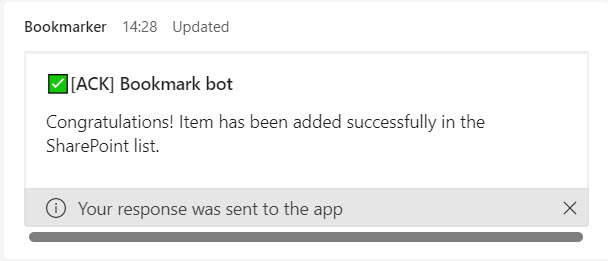

## Summary

This is a sample Bookmark bot for Microsoft Teams. It allows a user in Teams to create bookmark item in the SharePoint list using Microsoft Graph API. It also implements single sign-on authentication.

## Screenshots

## Frameworks

## Prerequisites

1. Set up and install Teams Toolkit for Visual Studio Code v5.0 pre-release version (4.99.2023041408) [How to install Teams Toolkit v5.0 pre-release](https://learn.microsoft.com/en-us/microsoftteams/platform/toolkit/install-teams-toolkit?tabs=vscode&pivots=visual-studio-code#install-a-pre-release-version).

2. [Node.js](https://nodejs.org/), supported versions: 16, 18

3. A [Microsoft 365 account for development](https://learn.microsoft.com/microsoftteams/platform/toolkit/tools-prerequisites#accounts-to-build-your-teams-app)

## Version history

Version|Date|Author|Comments
-------|----|----|--------
1.0|May 16, 2023|Ejaz Hussain|Initial release

## Disclaimer

**THIS CODE IS PROVIDED _AS IS_ WITHOUT WARRANTY OF ANY KIND, EITHER EXPRESS OR IMPLIED, INCLUDING ANY IMPLIED WARRANTIES OF FITNESS FOR A PARTICULAR PURPOSE, MERCHANTABILITY, OR NON-INFRINGEMENT.**

---

## Minimal Path to Awesome

### Create SharePoint List

>Create SharePoint list called **Bookmarks**

 | Column name | Column type            |
|-------------|------------------------|
| Title       | Single line of text    |
| URL         | Single line of text    |
| Tags        | Multiple lines of text |
| BookmarkComments    | Multiple lines of text |

### Get SharePoint site Id and list Id using Microsoft Graph API

1. To get SharePoint site Id, use the below. Replace <mark>hostname</mark> and <mark>sitename</mark> with your hostname and sitename.

>https://graph.microsoft.com/v1.0/sites/`{hostname}`.sharepoint.com:/sites/`{sitename}`

2. To get the List ID, you can use the following query

>https://graph.microsoft.com/v1.0/sites/`{site-id}`/lists/`{list-title}`

3. Run your application the first time

    ### Debug application

    1. In the application folder, run `npm install` to install the needed packages

    1. First, select the Teams Toolkit icon on the left in the VS Code toolbar.
    2. In the Account section, sign in with your [Microsoft 365 account](https://docs.microsoft.com/microsoftteams/platform/toolkit/accounts) if you haven't already.
    3. Press F5 to start debugging which launches your app in Teams using a web browser. Select `Debug (Edge)` or `Debug (Chrome)`.

    This will fail with an error stating that you need the SharePoint list ID and site ID. However it will create the .env.local file for you.

4. Add SharePoint information to your environment file

Edit **env/.env.local** and add these lines, substituting your site ID and list id obtained in steps 1 and 2

~~~text
SP_SITE_ID=your-site-id
SP_LIST_ID=your-list-id
~~~

5. Now run your application again. This time it should build correctly.
When Teams launches in the browser, select the Add button in the dialog to install your app to Teams.
The bot should run in a recent conversation and offer some command suggestions. Select "bookmark".

This will display an adaptive card, where you can enter the bookmark information. When the adaptive card is submitted, it will add your bookmark to the SharePoint lsit.

