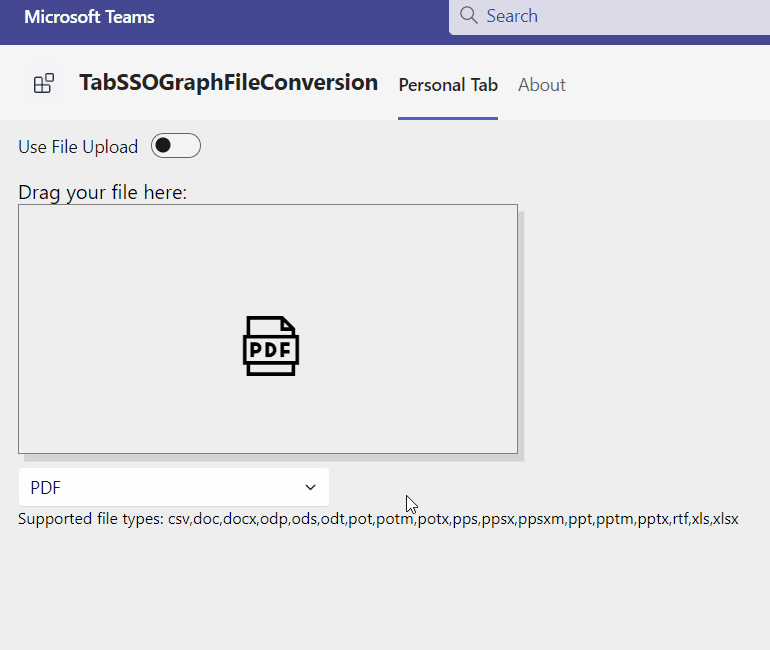
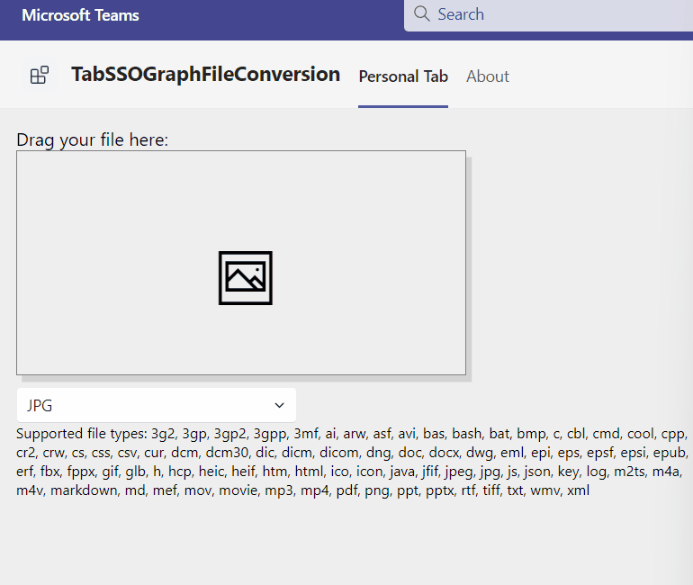
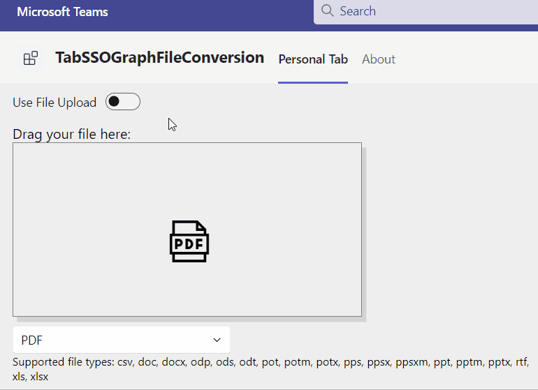

# tab-sso-graph-file-conversion-csharp
A Teams Tab with SSO and Microsoft Graph's file conversion capabilities

## Summary
This Teams Tab enables a user to upload a supported (depending on the target) file type via drag and drop while the uploaded file will be converted as PDF, HTML, JPG depending on user's selection.
In Teams context (as configurable Tab) it uses the current Teams' site and the default drive. In case of a personal tab the SharePoint root site's default drive'
It uses the following capabilities (mostly) on behalf of Microsoft Graph:
* Use HTML5 drag and drop event handling
* Writing normal files smaller 4MB
* Writing files bigger than 4MB with a resumable upload
* Retrieving files with format=pdf/html/jpg conversion which is currently supportred only with Graph beta endpoint

Select target file type:



File upload and JPG conversion:



Switch between drag&drop and file upload:



For further details see the author's [blog post](https://mmsharepoint.wordpress.com/2023/03/10/file-conversion-in-a-teams-tab-with-microsoft-graph-and-teams-toolkit-for-visual-studio-c/)

## Applies to

This sample was created [using the Teams Toolkit with Visual Studio 2022](https://learn.microsoft.com/en-us/microsoftteams/platform/toolkit/teams-toolkit-fundamentals?pivots=visual-studio&WT.mc_id=M365-MVP-5004617). The sample was also realized with Graph v1.0 enpoint as [PDF only conversion](https://github.com/mmsharepoint/tab-sso-graph-upload-pdf-csharp) and can be found [here](https://github.com/mmsharepoint/tab-sso-graph-upload-as-pdf).

## Version history

Version|Date|Author|Comments
-------|----|--------|--------
1.0|Apr 15, 2023|[Markus Moeller](http://www.twitter.com/moeller2_0)|Initial release

## Disclaimer

**THIS CODE IS PROVIDED *AS IS* WITHOUT WARRANTY OF ANY KIND, EITHER EXPRESS OR IMPLIED, INCLUDING ANY IMPLIED WARRANTIES OF FITNESS FOR A PARTICULAR PURPOSE, MERCHANTABILITY, OR NON-INFRINGEMENT.**

---
## Minimal Path to Awesome
- Clone the repository
    ```bash
    git clone https://github.com/pnp/teams-dev-samples.git
- Open samples\tab-sso-graph-file-conversion-csharp\tab-sso-graph-file-conversion.sln in Visual Studio
- Perform first actions in GettingStarted.txt (before hitting F5)
- This should [register an app in Azure AD](https://learn.microsoft.com/en-us/microsoftteams/platform/toolkit/add-single-sign-on?pivots=visual-studio&WT.mc_id=M365-MVP-5004617#add-sso-to-teams-app-for-visual-studio)
- Ensure there is an app 
  - with redirect uri https://localhost/blank-auth-end.html
  - SignInAudience multi-tenant
  - with client secret
  - with **delegated** permissions Files.ReadWrite and Sites.ReadWrite.All
  - With exposed Api "access_as_user" and App ID Uri api://localhost/<App ID>
  - With the client IDs for Teams App and Teams Web App 1fec8e78-bce4-4aaf-ab1b-5451cc387264 and 5e3ce6c0-2b1f-4285-8d4b-75ee78787346
- Find/Add the app registration ClientId, ClientSecret to your appsettings.json (or a appsettings.Development.json)
- Find/Fill OAuthAuthority with https://login.microsoftonline.com/_YOUR_TENANTID_
- Grant admin consent to the given permissions in the app registration
- Now you are good to go to continue in GettingStarted.txt with hitting F5 (You can also select an installed browser in the VS menu)

## Features
This is a simple Teams Tab. It enables a user to upload a supported file type via drag and drop or file upload while the uploaded file will be converted as PDF, HTML or JPG.
* SSO access token generation to access Microsoft Graph
* Call backend controller to execute O-B-O flow and Microsoft Graph requests
* [Upload large files with Microsoft Graph](https://learn.microsoft.com/en-us/graph/sdks/large-file-upload?tabs=csharp?WT.mc_id=M365-MVP-5004617)
* [Convert supported files to various target formats with Microsoft Graph](https://learn.microsoft.com/en-us/graph/api/driveitem-get-content-format?view=graph-rest-beta&tabs=http&WT.mc_id=M365-MVP-5004617)
  * Use HttpClient for this as the endpoint is beta and in the latest Microsoft Graph .NET SDK there is a [bug](https://github.com/microsoftgraph/msgraph-sdk-dotnet/issues/1621) in the format conversion option.
* [Use Fluent UI Web Components with Blazor](https://learn.microsoft.com/en-us/fluent-ui/web-components/integrations/blazor?WT.mc_id=M365-MVP-5004617)

[](https://github.com/microsoft/hack-together)

